<center><b> <font size="8"> 编译原理课程设计报告</font></b></centet>


<center>
    <b>
        <font size="6">
            <div style="float:left;width:15%;margin-left:15%;">题目：</div>
            <div style="float:center;width:70%;">类C语言编译器实现</div> 
		</font></b></centet>
    <b>
        <font size="6">
            <div style="float:left;width:15%;margin-left:15%;">专业：</div>
            <div style="float:center;width:70%;">计算机科学与技术</div> 
		</font></b></centet>
<center>
    <b>
        <font size="6">
            <div style="float:left;width:15%;margin-left:15%;">日期：</div>
            <div style="float:center;width:70%;">2019年5月4日</div> 
		</font></b></centet>
<div style="page-break-after: always;"></div>


# 一、课程设计题目要求

## 1、目的
+ 掌握使用高级程序语言实现一个一遍完成的、简单语言的编译器的方法。
+ 掌握简单的词法分析器、语法分析器、符号表管理、中间代码生成以及目标代码生成的实现方法。
+ 掌握将生成代码写入文件的技术。


## 2、要求
+ 使用高级程序语言作为实现语言，实现一个简单类C语言的编译器。编码实现编译器的组成部分。
+ 要求的类C语言编译器是个一遍的编译程序，词法分析程序作为子程序，需要的时候被语法分析程序调用。
+ 使用语法制导的翻译技术，在语法分析的同时生成中间代码，并保存到文件中。
+ 要求输入类C语言源程序，输出中间代码表示的程序和目标代码(可汇编执行)的程序。
+ 实现过程、函数调用的代码编译。


## 3、完成情况

+ 可进行类C词法检查并报错
+ 可进行类C语法检查并报错
+ 可进行类C语义检查并报错
+ 可生成中间代码并保存到文件
+ 可生成目标代码（ASM文件）
+ 支持函数嵌套调用以及函数递归


## 4、生成文件结构

```
gen_data
├── lexcial_analyzer
|   └── lexical_analyser_result.txt
|
├── syntactic_analyzer
|   ├── action_goto_tables.csv
|   ├── fisrts.txt
|   ├── follows.txt
|   ├── items.txt
|   ├── normal_families.txt
|   ├── productions.txt
|   ├── symbols.txt
|   └── syntactic_analyser_process.csv
|
├── target_file
|   ├── intermediate_code.txt
|   └── target_code.txt
```


# 二、文法

&emsp;&emsp;**本编译器采用SLR(1)文法从而实现对类C语言的识别与翻译。**下列文法是从课程设计中包含过程调用的类C语法规则改造而来的，涵盖了：基本数据运算、函数定义与调用、全局变量定义、分支结构、循环结构等。

## 1、含过程调用的类C语法规则

<table>
	<tr>
		<td>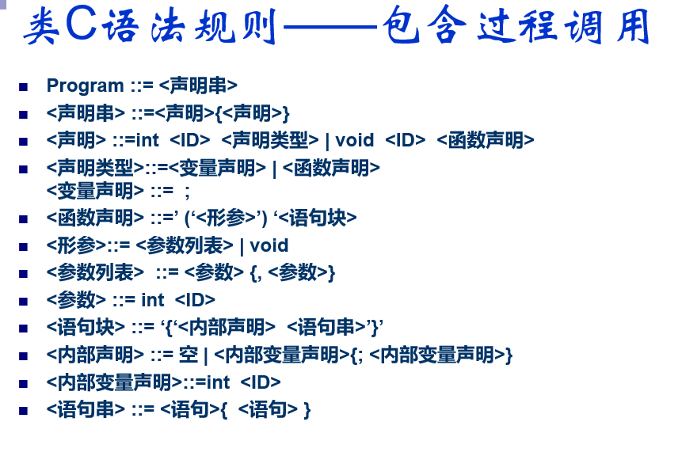</td>
		<td></td></tr>
</table>


## 2、文法内容

>Program->Stmt_string

>Stmt_string->Stmt_loop Stmt

>Stmt_loop->Stmt_loop Stmt|$

>Stmt->int identifier Stmt_type|void identifier Create_Function_table Function_stmt

>Stmt_type->Variavle_stmt|Create_Function_table Function_stmt

>Create_Function_table->$

>Variavle_stmt->;

>Function_stmt->( Formal_parameter ) Sentence_block Exit_Function_table

>Exit_Function_table->$

>Formal_parameter->Formal_parameter_list|void|$

>Formal_parameter_list->Parameter_loop Parameter

>Parameter_loop->Parameter_loop Parameter ,|$

>Parameter->int identifier

>Sentence_block->Sentence_block_m { Internal_stmt Sentence_string }

>Sentence_block_m->$

>Internal_stmt->$|Internal_variable_stmt ; Internal_stmt

>Internal_variable_stmt->int identifier

>Sentence_string->Sentence_loop Sentence

>Sentence_loop->Sentence_loop Sentence|$

>Sentence->If_sentence|While_sentence|Return_sentence|Assign_sentence

>Assign_sentence->identifier = Expression ;

>Return_sentence->return Return_expression ;

>Return_expression->$|Expression

>While_sentence->while While_sentence_m1 ( Expression ) While_sentence_m2 Sentence_block

>While_sentence_m1->$

>While_sentence_m2->$

>If_sentence->if If_sentence_m0 ( Expression ) If_sentence_m1 Sentence_block If_expression

>If_expression->$|If_sentence_n else Sentence_block

>If_sentence_m0->$

>If_sentence_m1->$

>If_sentence_n->$

>Expression->Add_expression_loop Add_expression

>Add_expression_loop->$|Add_expression_loop Add_expression Relop

>Relop-><|<=|>|>=|==|!=

>Add_expression->Item_loop Item

>Item_loop->$|Item_loop Item +|Item_loop Item -

>Item->Factor_loop Factor

>Factor_loop->$|Factor_loop Factor *|Factor_loop Factor /

>Factor->Const_value|( Expression )|identifier FTYPE

>FTYPE->Call_func|$

>Call_func->( Call_func_check Actual_parameter_list )

>Call_func_check->$

>Actual_parameter_list->$|Expression_loop Expression

>Expression_loop->$|Expression_loop Expression ,

>Const_value->num


**注：**

1.  \$  表示  $\epsilon$
2. 上述文法中引入的大量的  GrammarSymbol -> \$ 是为了执行语义分析的动作


# 三、功能模块及描述
## 1、词法分析器
&emsp;&emsp;词法分析器是从左到右逐个字符地对源程序进行扫描，产生一个个的单词符号，把作为字符串的源程序改造成为单词符号串的中间程序。因为要完成一遍翻译，因此词法分析器被语法分析器所调用，每完成一次语法分析后语法分析器就向词法分析器申请下一个字符串的信息。

&emsp;&emsp;本模块可以识别常量、标识符、关键字、运算符以及界符，同时能够自动跳过空行、换行符与制表符。

```c++
class LexicalAnalyzer {
private:
	//所有运算符
	set<string> OPERATORS = { "+", "-", "*", "/", "=", "==", ">", ">=", "<", "<=", "!="};

	//关键字
	set<string> KEYWORDS = { "if", "else", "return", "while"};

	//变量类型
	set<string> TYPES = { "int", "void"};

	//前置运算符
	set<string> PRE_OPERATORS = { "+", "-"};

	//界符
	set<char> BORDERS = { '(', ')', '{', '}', ',', ';'};

	ifstream code_reader_;
	ofstream lexical_analyser_printer_;

	unsigned int line_counter_;//用于词法分析发生错误时的行数定位
	bool print_detail_;//选择是否将词法分析结果输出到txt中
	unsigned int step_counter_;//词法分析计步器

	bool IsLetter(const unsigned char ch);//是否字母
	bool IsDigital(const unsigned char ch);//是否数字
	bool IsSingleCharOperator(const unsigned char ch);//是否单符号运算符
	bool IsDoubleCharOperatorPre(const unsigned char ch);//是否双符号运算符
	bool IsBlank(const unsigned char ch);//是否是空白符
	unsigned char GetNextChar();//获取字符流中的下一个字符，同时计算行数。
	void PrintDetail(WordInfo word);//打印词法分析信息
	WordInfo GetBasicWord();//获取文法符号,但是无法进行打印

public:
	LexicalAnalyzer();
	~LexicalAnalyzer();
	bool IsReadyToAnalyze(bool show_detail = true, const string code_filename="./raw_data/test.cpp");//文件是否读到
	WordInfo GetWord();//获取文法符号，可进行打印信息。

};
```


## 2、语法分析器

&emsp;&emsp;语法分析是编译过程的核心部分。它的任务是在词法分析识别出单词符号串的基础上，分析并判定程序的语法结构是否符合语法规则。由于需要一遍翻译，因此此处采用SLR(1)文法自下而上分析，从输入串开始，逐步进行**“规约”**，直至规约到文法的开始符号。

&emsp;&emsp;本模块首先对指定的输入文法进行分析，包括生成First集合、Follow集合、项目集规范族、Action与Goto表。判断指定的输入文法是否为SLR(1)文法，若不是SLR(1)文法，则会在CMD窗口上输出存在冲突的项目集规范族进行提示。如果满足SLR(1)文法后，就会开始进行语法分析，并对各种语法错误进行输出不符合文法的错误提示。

```c++
class SyntacticAnalyzer {
private:
	bool print_detail_;
	vector<Grammar> grammars_;
	vector<Production> productions_;//将gammars_中的产生式拆开成多个产生式，方便编号。
	set<string> grammar_symbol_;//语法的所有符号，包括终结符与非终结符。
	map<string, set<string>> first_map_, follow_map_;//First集合、Follow集合
	vector<set<LrItem>> normal_family_;//LR0项目集规范族
	set<LrItem> lr_items_;//LR0所有项目
	map<pair<int, string>, SlrOperation> action_goto_tables_;//action 与 goto 表的融合
	ofstream syntactic_analyzer_printer_;//语法分析过程打印
	vector<string> move_conclude_string_stack_;//存放 移进规约串的栈
	vector<int> state_sequence_stack_;//状态序列栈
	SemanticAnalyzer sementic_analyzer_;//语义分析器，在规约的时候被使用，进行语义检查
	vector<GrammarSymbolInfo> grammar_symbol_info_stack_;//语义分析的时候用到的文法符号属性栈

	bool IsNonTerminalSymbol(const string &symbol);//判断是否为非终结符
	bool GenProduction();//从grammar.txt中生成产生式
	void GenAugmentedGrammar();//生成拓广文法
	void GenFirstSet();//生成First集合
	void GenFollowSet();//生成Follow集合
	void GenGrammarSymbolSet();//生成文法符号集合
	bool GenNormalFamilySet();//生成项目集规范族、Action与Goto表，返回false则说明文法不是SLR，带有冲突
	void GenLrItems();//生成LR0所有项目
	bool BuildGrammar();//对grammar.txt文件进行分析，生成以上所有集合。
	set<LrItem> GenItemClosureSet(const LrItem &);//生成某个项目的闭包集合
	set<LrItem> GenItemsClosureSet(const set<LrItem> &);//生成某个项目集的闭包集合
	set<string> GetProductionFirstSet(const vector<string> &);//获取某个串的First集合


	void PrintBuildGrammarDetails();//对grammar.txt文件进行分析，生成以上所有集合。
	void PrintProdcutions(const string filename = "./gen_data/syntactic_analyzer/productions.txt");//打印产生式
	void PrintGrammars();//打印文法
	void PrintFirst(const string filename = "./gen_data/syntactic_analyzer/fisrts.txt");//打印First集合
	void PrintFollow(const string filename = "./gen_data/syntactic_analyzer/follows.txt");//打印Follow集合
	void PrintGrammarSymbolSet(const string filename = "./gen_data/syntactic_analyzer/symbols.txt");//打印GrammarSymbol集合
	void PrintLrItems(const string filename = "./gen_data/syntactic_analyzer/items.txt");//打印LrItems集合
	void PrintClosure();//打印Closure集合，debug时候使用
	void PrintSlrError(const set<LrItem> &);//打印SLR分析中存在冲突的规范族，出现错误的时候直接显示在CMD窗口上
	void PrintNormalFamiliySet(const string filename = "./gen_data/syntactic_analyzer/normal_families.txt");//打印所有规范族
	void PrintActionGotoTable(const string filename = "./gen_data/syntactic_analyzer/action_goto_tables.csv");//打印Action和Goto表

	void PrintAnalysisProcess(int step, const SlrOperation &sl_op);//打印语法分析过程

public:
	SyntacticAnalyzer(bool show_detail = true);
	~SyntacticAnalyzer();
	bool StartAnalize();//开始进行语法分析
};
```


## 3、语义分析器

&emsp;&emsp;语义分析器是在语法分析器进行文法规约的时候被调用。由于要完成一遍扫描翻译，这里考虑使用S-属性文法的自下而上计算。综合属性可以在分析输入符号串的同时由自下而上的分析器来计算，保存与栈中文法符号有关的综合属性值，每当进行规约的时候，新的属性值就由栈中正在规约的产生式右边符号的属性值来计算，同时生成中间代码。

&emsp;&emsp;本模块可以判断函数调用是否符合规范、变量使用之前是否定义以及生成中间代码。

```c++
class SemanticAnalyzer
{
private:
	vector<SymbolTable> symbol_tables_;//符号表容器，每一个符号表对应一个过程
	vector<int> current_symbol_table_stack_;//当前所处定义域的所有相关层次的符号表的序号栈
	bool CreateSymbolTable(TABLE_TYPE, const string &);//创建一个新的符号表，并修改当前符号表

	int next_state_num_;//下一个四元式的序号。这里从1开始，0留给跳转到程序起始地址的四元式
	ofstream intermediate_code_temp_printer_;//中间代码临时文件打印机
	fstream intermediate_code_temp_reader_;//中间代码临时文件读取
	ofstream intermediate_code_printer_;//中间代码打印机

	int backpatching_level_;//回填的层次，从0开始。 这是由于回填会嵌套
	vector<Quadruples> quadruples_stack_;//存放回填四元式，回填完毕后统一输出。
	vector<int> backpatching_value;//回填的值
	vector<int> backpatching_point_pos_;//回填点在回填栈中的地址
	int main_line_;//main函数的序号
	bool PrintQuadruples(const Quadruples &);//根据四元式进行打印中间代码临时文件
	bool PrintQuadruples();//根据临时文件打印中间代码

	vector<string> w_label_;//用来记录while，if语句Label。 这里是记录写出的Label
	vector<string> j_label_;//记录要跳转的Label
	vector<int> w_j_label_nums;//记录每层的while,if数目
	int w_j_label_num_;//初始为0，每进入一个函数就设0，出去设

	TargetCodeGenerator target_code_generator_;//目标代码生成器

	//生成目标代码中跳转用的标签号，防止重复
	int while_cnt_;
	int if_cnt_;

public:
	SemanticAnalyzer();
	~SemanticAnalyzer();

	bool ExecuteSemanticCheck(vector<GrammarSymbolInfo>&, const Production &);//执行语义分析检查,并根据产生式修改文法符号属性栈
	int GetNextStateNum();//返回下一个四元式的序号，并且序号加1
	int PeekNextStateNum();//查看下一个四元式的序号
	
	string GetArgName(SymbolPos &, bool is_return=false);//在中间代码生成的时候，获取变量的名称。 对于不是临时变量的变量，需要加上表的序号，例如： a_2
	
};
```


## 4、目标代码生成器

&emsp;&emsp;目标代码生成器编译过程的最后阶段，生成ASM汇编文件。常规的做法是将中间代码翻译成目标代码，这里为了方便，选择直接在语义分析的过程中一并生成目标代码。因为最终是翻译成MIPS的汇编代码，所以需要管理MIPS中对应的10个临时寄存器。同时，为了实现函数嵌套调用和递归，还需要进行栈帧的构建和维护。

```c++
class TargetCodeGenerator {
private:
	ofstream target_code_printer_;//目标代码打印机
	vector<SymbolTable> *symbol_tables_pt_;//符号表容器指针，每一个符号表对应一个过程   ----与语义分析器共享同一个。 使用的时候解指针
	
	vector<RegisterInfo> registers_ = { { "$t0","" },{ "$t1","" },{ "$t2","" },{ "$t3","" },{ "$t4","" },
										{ "$t5","" },{ "$t6","" },{ "$t7","" },{ "$t8","" },{ "$t9","" } };//临时寄存器的初始化

	int gf_offset;//gf的偏移, 这个1个单位代表内存4个单位。前1024个单元（1024*4）留给全局变量
	void SetMissTime(int reg);//除了reg变成0，其余都+1
public:
	TargetCodeGenerator();
	~TargetCodeGenerator();
	void TargetCodeGeneratorInit(vector<SymbolTable> &);
	bool PrintQuadruples(const Instructions &);//根据指令进行打印目标代码临时文件
	bool PrintQuadruples(const string&);//生成对应与string的跳转label
	bool PushStack_sp(int num);//sp+4*num的指令，在声明变量、函数调用时候执行
	bool CreateStackFrame();//发生函数调用后，进入被调用函数时，首先进行栈帧的构建； 项目：返回地址、旧fp
	bool InitialSpFpGp();//初始化sp,fp,gp的值
	int GetTempReg();//使用LRU算法获取接下来应该被使用的寄存器。返回寄存器在vector中的序号
	bool LoadTempReg(int reg, SymbolPos &pos);//把符号表中指定的符号写到指定reg
	bool IsSymbolLoaded(SymbolPos &)const;//判断符号是否已经被加载到寄存器上
	string GetMemAddr(const SymbolPos &pos)const;//根据Pos返回内存地址 4($gp), -4($fp) 等等
	bool PrintSyscall();//main的结束
	int LoadImmToReg(const string&, const SymbolPos &pos);//把立即数加载到临时寄存器中，并返回寄存器的序号
	string SetArgBeReady(SymbolPos pos);//让参与运算的数进入临时寄存器，返回寄存器名称
	bool ClearRegs();//将寄存器上的局部变量全部写回，并情况寄存器
	bool ResetRegs();//将10个寄存器设置成no_possessed
};
```


## 5、符号表

&emsp;&emsp;符号表用于管理定义的全局变量、局部变量、临时变量、函数等，被语义分析器维护，在定义变量等出现新符号时，符号表添加相应的成员。

&emsp;&emsp;为了便于实现内层定义域可以调用外层定义域数据的功能，每个函数都维护一张符号表；第0号表留给全局变量与函数，第1号表留给临时变量。

```c++
class SymbolTable
{
private:
	vector<Symbol> table_;//用vector来存放各个符号，形成一张符号表
	TABLE_TYPE table_type_;//符号表的类型
	string name_;//符号表的名称
    
public:
	SymbolTable(TABLE_TYPE, string = "");
	~SymbolTable();
	TABLE_TYPE GetTableType();//返回整个符号表的类型
	int AddSymbol(const Symbol &);//向符号表中添加符号并返回符号在符号表中的序号。若存在符号，则返回-1
	int AddSymbol(const string &);//向临时符号表中添加符号并返回符号在符号表中的序号
	int AddSymbol();//向临时符号表中添加符号并返回符号在符号表中的序号

	int FindSymbol(const string &) const;//在符号表中寻找是否存在指定名称的符号，没有则返回-1，有则返回序号
	int FindConst(const string &) const;//在符号表中寻找是否存在指定的常数，没有则返回-1，有则返回序号
	bool SetValue(int pos, string &);//根据pos来设置value
	string GetSymbolName(int pos) const;//根据pos获取符号名称
	CATEGORY GetSymbolMode(int pos)const;//根据pos获取符号模式
	VARIABLE_TYPE GetSymbolType(int pos)const;//根据pos获取符号类型
	string GetTableName()const;//获取当前符号表的名称
	Symbol &GetSymbol(int pos);//根据pos获取符号
	vector<Symbol> &GetTable();//返回整个符号表

};
```


## 6、公用函数

&emsp;&emsp;在此处定义了一些上述五大功能模块都需要使用到的结构体，方便使用。

```c++
struct WordInfo//综合属性
{
	LEXICAL_TYPE type;//词类型
	string value;//常量的值，或者关键字本身
	string word_string;//进行语义分析时的符号
	int functionIndex;
};

struct SymbolPos {
	int table_pos;//变量、常量、临时变量 所在table在所有table中的序号
	int symbol_pos;//变量、常量、临时变量 所在table中的位置
	SymbolPos(int tp, int sp) { table_pos = tp; symbol_pos = sp; }
	SymbolPos() {};
};

struct GrammarSymbolInfo//语义分析时候用到的文法符号属性
{
	string symbol_name;//对应与grammar中的名称
	string txt_value;//对应的文本属性值
	SymbolPos pos;//table,symbol的位置
	string op;//表示 +, -, *, /
};

struct Grammar//右部包含多个
{
	string left;
	vector<string> right;
};

struct Production//产生式
{
	string left;
	vector<string> right;
};

struct Quadruples//四元式
{
	int num;//行号
	string op;
	string arg1;
	string arg2;
	string result;
	Quadruples();
	Quadruples(int n, const string &o, const string &a1, const string &a2, const string &r);
	void SetContent(int n, const string &o, const string &a1, const string &a2, const string &r);
};

struct Instructions//目标代码指令
{
	string op;
	string arg1;
	string arg2;
	string arg3;
	Instructions();
	Instructions(const string &op, const string & arg1, const string & arg2, const string & arg3);
	void SetContent(const string &op, const string & arg1, const string & arg2, const string & arg3);
};

struct RegisterInfo//临时寄存器的信息 方便寄存器值和内存之间传递
{
	const string name;//"$t0"之类的
	string content;//具体的数值
	SymbolPos content_info;//content的信息,通过Pos来定位symbol的位置。从而获取symbol的信息
	int miss_time = 0;//未使用次数，没有空闲寄存器时，腾出最久未被使用的寄存器
	bool is_possessed = false;//表示是否被占用。 在从函数return之后，需要释放局部定义的变量所占用的寄存器
};
```


# 四、主要算法
## 1、词法分析

### 1)、识别单词符号

&emsp;&emsp;精简的状态转换图：

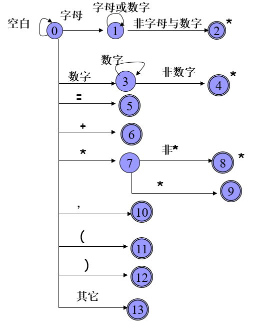

&emsp;&emsp;使用**状态转换图**方式识别单词符号，步骤如下：

> 1. 从初态开始；
> 2. 从输入串中读一个字符；
> 3. 判明读入字符与从当前状态出发的哪条弧上 的标记相匹配，便转到相应匹配的那条弧所指向的状态；
> 4. 重复步骤3，均不匹配时便告失败；到达终态时便识别出一个单词符号。

&emsp;&emsp;

&emsp;&emsp;上述识别过程中需要使用超前搜索算法。例如：在状态1之下，若下一个输入字符为字母或者数字，则读进它，并重新进入状态1。一直重复这个过程直到状态1发现输入字符不再是字符或者数字时（这个字符也被读进）就进入状态2。状态2是终态，它意味着到此已识别出一个标识符，识别过程宣告终止。终态上打个星号*意味着多读进一个不属于标识符部分的字符，应该把它退还给输入串。


## 2、语法分析
### 1)、构造FIRST集
对于文法$G$的每个文法符号$\mathbf{X} \in \mathbf{V}_{\mathbf{T}} \cup \mathbf{V}_{\mathbf{N}}$，使用下面的规则构造$FlRST $$(X)$，直至$FIRST$集合不再增大。
>**1.** 若$\mathbf{X} \in \mathbf{V}_{\mathbf{T}}$，则$FIRST $$(X)=\{X\}$；
>
>**2.** 若$\mathbf{X} \in \mathbf{V}_{\mathbf{N}}$，且有产生式$\mathbf{X} \rightarrow \mathbf{a} \ldots$ ，其中 $  \mathbf{a} \in \mathbf{V}_{\mathbf{T}}$，则把$a$加入到$FIRST $$(\mathrm{X})$中；
>
>     ​	若有$X \rightarrow \varepsilon$，则把$\varepsilon$加入$FIRST $$(X)$；
>
>**3.** 若$\mathbf{X} \in \mathbf{V}_{\mathbf{N}}$，$\mathbf{X} \rightarrow \mathbf{Y} \ldots$是个产生式且 $\mathbf{Y} \in \mathbf{V}_{\mathbf{N}}$，则把$FIRST $$(Y)-\{\varepsilon\}$加到$FIRST $$(X)$中；
>
>      	若$X \rightarrow Y_{1} Y_{2} \ldots Y_{k}$是一个产生式，$Y_{1}, Y_{2}, \dots, Y_{i-1} \in V_{N}$，且有 $\varepsilon \in \mathrm{FIRST}\left(\mathrm{Y}_{\mathrm{j}}\right)$ ， 其中$(1<=j<=i-1)$，则把$FIRST $$\left(Y_{i}\right)-\{\varepsilon\}$加到$FIRST $(X)中。 
>
>      	特别地，若$\varepsilon \in$ $FIRST $$\left(Y_{i}\right) \quad(1<=j<=k)$，则$\varepsilon \in \mathrm{FIRST}(\mathrm{X})$。


### 2)、构造FOLLOW集
对于文法$G$的每个非终结符A构造$FOLLOW$(A)，直至每个$FOLLOW$集合不再增大为止。
>**1.** 若$A$为文法开始符号，置$\#$于$FOLLOW$(A）中；
>
>**2. **若有产生式$\mathbf{B} \rightarrow \mathbf{\alpha} \mathbf{A} \boldsymbol{\beta}$，则将$\mathrm{~ F I R S T ( \beta ) ~ - ~ \{ \varepsilon \} ~}$加到$FOLLOW $(A)中；
>
>**3.** 若有$B \rightarrow \alpha A$或$\mathbf{B} \rightarrow \alpha \mathbf{A} \boldsymbol{\beta}$, 且$\boldsymbol{\beta} \stackrel{*}{\Rightarrow} \boldsymbol{\varepsilon}$则将$FOLLOW$(B)加到$FOLLOW$(A)中；
>
>**4.** 反复使用以上规则, 直至 $FOLLOW$(A)不再增大为止。 


### 3)、构造项目集规范族
**项目集I的闭包CLOSURE(I)：**
&emsp;&emsp;假定I是文法$G'$的任一项目集，定义和构造$I$的闭包$CLOSURE(I)$如下：
>1.  $I$的任何项目都属于$CLOSURE(I)$；
>
>2.  若$\mathbf{A} \rightarrow \alpha \cdot \mathbf{B} \beta$属于$CLOSURE(I)$，那么，对任何关于B的产生式$\mathbf{B} \rightarrow \gamma$，项目$B \rightarrow \cdot\gamma$也属于$CLOSURE(I)$；
>
>3.  重复执行上述两步骤直至$CLOSURE(I) $不再增大为止。


**状态转换函数GO(I，X):**
&emsp;&emsp;$GO$是一个状态转换函数。$I$是一个项目集，$X$是一个文法符号。函数值$GO(I，X)$定义为：
$$
\mathrm{GO}(\mathrm{I}, \mathrm{X})=\mathrm{CLOSURE}(\mathrm{J})
$$

其中，
$$
J＝\{任何形如\mathbf{A} \rightarrow \alpha \mathbf{X} \cdot \boldsymbol{\beta}的项目| \mathbf{A} \rightarrow \alpha \cdot \mathbf{X} \beta属于I\}。
$$


**LR(0)项目集规范族构造算法:**

```
PROCEDURE  ITEMSETS(G')；
BEGIN
	C:={CLOSURE({S'->·S})}；
	REPEAT
	    FOR  C中每个项目集I和G'的每个符号X  DO
		  IF  GO(I，X)非空且不属于C   THEN
		     把GO(I，X)放入C族中;
	UNTIL C	不再增大
END
```


### 4)、构造ACTION表和GOTO表

>1. 若项目$\mathbf{A} \rightarrow \alpha \cdot \mathbf{a} \beta$ 属于 $\mathbf{I}_{\mathbf{k}}$且$\mathrm{GO}\left(\mathrm{l}_{\mathrm{k}}, \mathrm{a}\right)=\mathrm{I}_{\mathrm{j}}$，$a$为终结符，则置ACTION[k,a] 为“$sj$”。
>
>2. 若项目$\mathbf{A} \rightarrow \alpha \cdot $ 属于$\mathbf{I}_{\mathbf{k}}$，那么，对任何终结符$a$(或结束符$\#$)，置ACTION[k,a]为 “$rj$”(假定产生式$\mathbf{A} \rightarrow \alpha$是文法$G'$的第$j$个产生式)。
>
>3. 若项目$\mathbf{S}^{\prime} \rightarrow \mathbf{S} \cdot$属于$\mathbf{I}_{\mathbf{k}}$，则置ACTION[k,#]为 “$acc$”。
>
>4. 若$\mathrm{GO}\left(\mathrm{I}_{\mathrm{k}}, \mathrm{A}\right)=\mathrm{I}_{\mathrm{j}}$，$A$为非终结符，则置GOTO[k,A]=$j$。
>
>5. 分析表中凡不能用规则1至4填入信息的空白格均置上“$报错标志$”。
>


### 5)、构造语法分析控制程序

>**三元式**  ( 栈内状态序列,  移进归约串,  输入串 )  的变化：
>**开    始:**   $ (     S_0, 		 \#, 	 	           a_1a_2 . . . a_n\# )$
>**某一步:**   $ (S_0S_1 . . . S_m,        \#X_1X_2 . . . X_m,       a_i a_{i+1} . . . a_n \#)$
>**下一步:**    $ACTION [S_m, a_i ]$
  若 $ACTION [S_m, a_i ] $为 “移进” 且$GOTO [S_m, a_i ] = S$
  则三元式为 
 $  ( S_0S_1 . . . S_m S,        \#X_1X_2 . . . X_ma_i ,     a_{i +1} . . . a_n\# )  $
  若 $ACTION [S_m, a_i ] $为 “  归约” $\{\mathbf{A} \rightarrow \boldsymbol{\beta}\}$,  且$|\beta|=r$ ，$\beta=X_{m-r+1} \dots X_{m}$, $GOTO [S_{m-r}, A]
=S$
  则三元式为 ：
$$
(S_0S_1 . . . S_{m-r} S,       \#X_1X_2 . . . X_{m-r} A,   a_i a_{i+1} . . . a_n \# )
$$
>  若$ACTION [S_m, a_i ] $为“  接受” 则结束
>  若$ACTION [S_m, a_i ] $为“  报错” 则进行出错处理


### 6)、SLR(1)分析表的构造方法
>1. 对于$\mathbf{A} \rightarrow \alpha$，$\mathbf{G O}\left[\mathbf{S}_{\mathbf{i}}, \mathbf{X}\right] \in \mathbf{S}_{\mathbf{j}}$ ，若
              $\mathbf{X} \in \mathbf{V}_{\mathbf{T}}$ ，则置$\operatorname{actoin}\left[\mathrm{S}_{\mathrm{i}}, \mathrm{X}\right]=\mathrm{S}_{\mathrm{j}}$
              $\mathbf{X} \in \mathbf{V}_{\mathbf{N}}$ ，则置$\operatorname{goto}\left[S_{i}, X\right]=\mathbf{j}$
>2. 对于归约项目$\mathbf{A} \rightarrow \boldsymbol{\alpha} \cdot \in \mathbf{S}_{\mathbf{i}}$ , 若$\mathbf{A} \rightarrow \alpha$为文法的第$j$个产生式，则对任何输入符号$a$，若$\mathbf{a} \in$ Follow $(\mathbf{A})$，则置$\operatorname{action}\left[\mathrm{S}_{\mathrm{i}}, \mathrm{a}\right]=\mathbf{r}_{\mathbf{j}}$
>
>3. 若$\mathrm{s} \rightarrow \alpha \cdot \in \mathbf{S}_{\mathrm{i}}$，则置action[Si , #]=acc
>
>4. 其它情况均置出错。


## 3、语义分析
&emsp;&emsp;在执行语法规约的时候调用语义分析。

###	1)、符号表维护

&emsp;&emsp;全局变量和函数信息存在全局符号表中，所有临时变量存储在临时符号表中。每个函数同时拥有和维护一张属于自己的符号表。各层的符号表是嵌套的，内层定义域可以访问外层符号表的变量，这满足了C语言的语义规则。


###	2)、综合属性计算
&emsp;&emsp;作为一个一遍完成的、自底向上分析的编译器，结合S-属性文法，在每次规约的时候，为需要计算综合属性的文法符号计算综合属性。综合属性会在某次规约产生中间代码和目标代码时使用并且依次向上传递。


## 4、中间代码生成

### 1)、翻译及中间代码表示

&emsp;&emsp;中间代码的产生是发生在某次语法规约的时候。这里采用四元式的形式来表示中间代码。例如
$$
11 (:=, T2, -, f-facVar)
$$
11表示该四元式是第11条四元式，$:=$表示操作符类型，后三个位置分别表示第一个运算量、第二个运算量以及存储结果的的变量。变量的含义表示如下表格：

| 符号                | 含义                   |
| ------------------- | ---------------------- |
| $Ti$                | 第$i$个临时变量        |
| $f-facVar$          | 函数fac中的局部变量f   |
| $x-fac\_paramerter$ | 调用函数fac时传给形参x |
| $fac-return\_value$ | 函数fac中的返回值      |


### 2)、出口回填
&emsp;&emsp;因为是一遍完成的翻译过程，所以选择分支和循环分支的真假出口是无法提前获知，即在翻译的过程中无法在对应的规约过程中跳转到正确的位置。因此本编译器维护了四元式栈，当进入选择分支或者循环分支后，不再直接输出四元式，而是将四元式存入栈中，并且记下来栈中需要回填的四元式的序号，等退出循环分支或者选择分支时将下一个四元式序号回填给最近的需要回填的四元式，当退出所有的循环分支或者选择分支后，四元式栈中就不需要再回填了，此时将栈中的四元式输出即可。


## 5、目标代码生成

### 1)、翻译及目标代码表示

&emsp;&emsp;因为本次编译器的实现是一遍完成的，所以中间代码和目标代码需要同时生成。目标代码生成器可以直接获取中间代码的组成信息，而不需要再分析四元式，这样可以简化目标代码的生成过程。本编译器最终生成的目标代码是MIPS汇编指令，可以直接在Mars下汇编执行。


### 2)、寄存器分配

&emsp;&emsp;优秀的寄存器分配算法可以提高程序的运行速度，因此本编译器采用的寄存器分配算法是一个类似于操作系统中内存页面LRU置换算法，即当找不到空闲的寄存器时，将最久未被使用的寄存器置回存到内存中，然后再使用该寄存器。对于最久未被使用的定义如下：

>10个临时寄存器都维护一个Miss_time变量用来记录没被使用的次数。
>
>初始的情况下，每个临时寄存器中的Miss_time都是0.
>
>当某寄存器被读取或者写入时，该寄存器Miss_time就被设置为0，其它寄存器的Miss_time就加1。
>
>Miss_time最大的临时寄存器就是最久没被使用的寄存器。


### 3)、函数栈帧处理

&emsp;&emsp;为了实现函数的嵌套调用与递归调用，在生成的目标代码中需要构建一个与操作系统中维护中断类似的栈帧。每进入一个函数，就把\$ra寄存器中的返回地址压入栈帧，接着将老\$fp也压入栈帧中。每次函数调用返回后就修改\$fp与\$sp的值进行栈帧的释放。栈帧的结构如下：

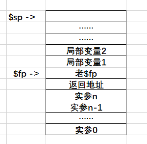


# 五、程序流程图

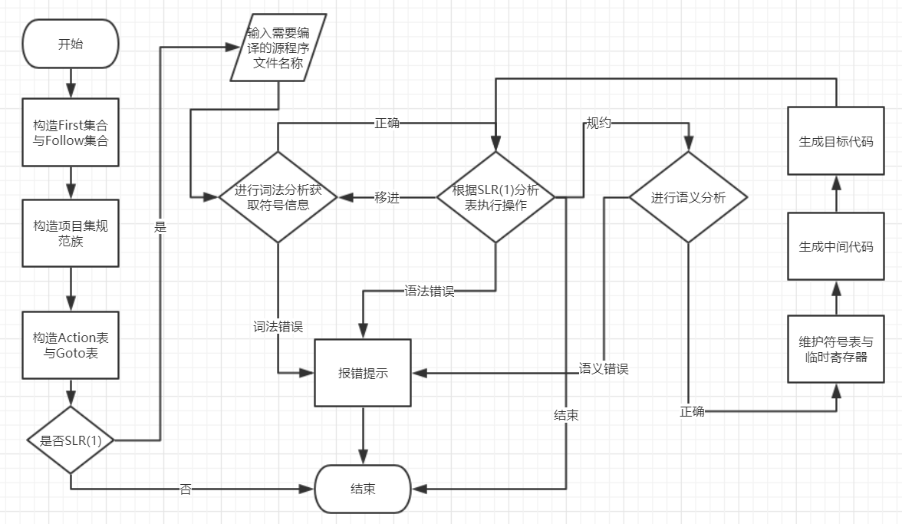


# 六、运行样例

## 1、词法分析错误提示

<table>
    <tr>
        <td>源码</td>
		<td>显示</td></tr>
    <tr>
		<td>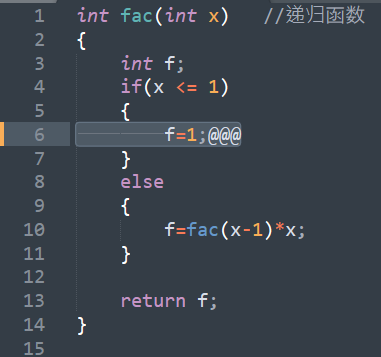</td>
		<td>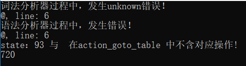</td></tr>
</table>


## 2、词法分析过程输出
<table>
    <tr>
        <td>源码</td>
		<td>显示</td></tr>
    <tr>
		<td>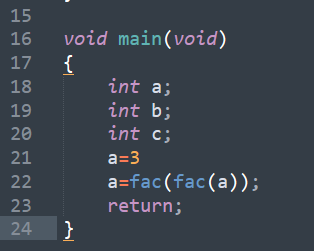</td>
		<td>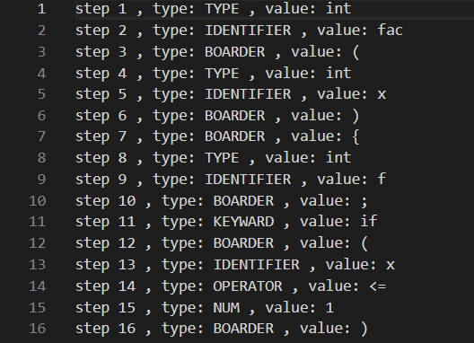</td></tr>
</table>


## 3、文法冲突提示

<table>
    <tr>
        <td>错误文法</td>
		<td>显示</td></tr>
    <tr>
		<td>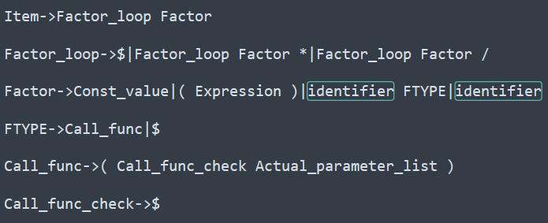</td>
		<td>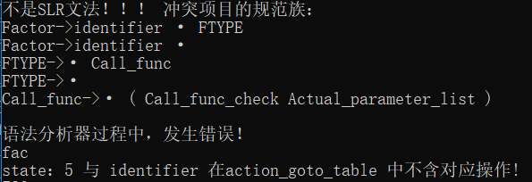</td></tr>
</table>


## 4、文法信息输出
<table>
    <tr>
        <td>First集合</td>
		<td>Follow集合</td></tr>
    <tr>
		<td>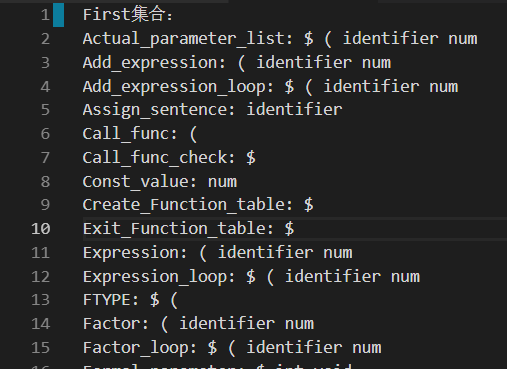</td>
		<td>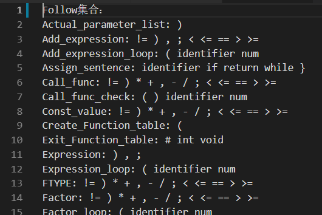</td></tr>
</table>

<table>
	<tr>
        <td>LR0项目</td>
		<td>项目集规范族</td></tr>
    <tr>
		<td>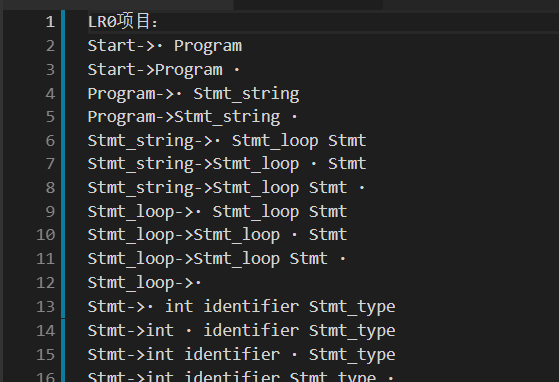</td>
		<td>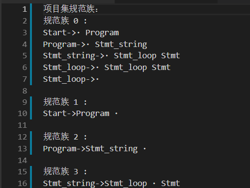</td></tr>
</table>
<table>
    <tr>
		<td>ACTION & GOTO 表 </td></tr>
    <tr>
		<td>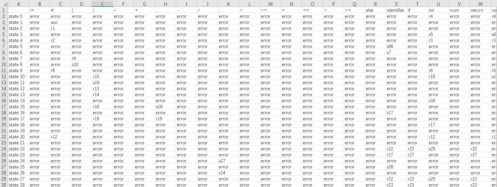</td></tr>
    <tr>
		<td>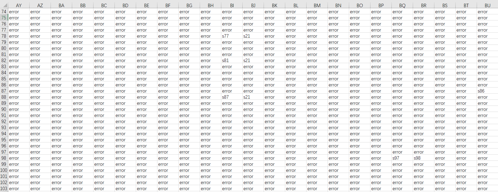</td></tr>
</table>


## 5、语法分析错误提示

<table>
    <tr>
        <td>错误文法</td>
		<td>显示</td></tr>
    <tr>
		<td></td>
		<td>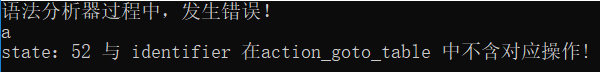</td></tr>
</table>


## 6、语法分析信息输出

<table>
    <tr>
		<td>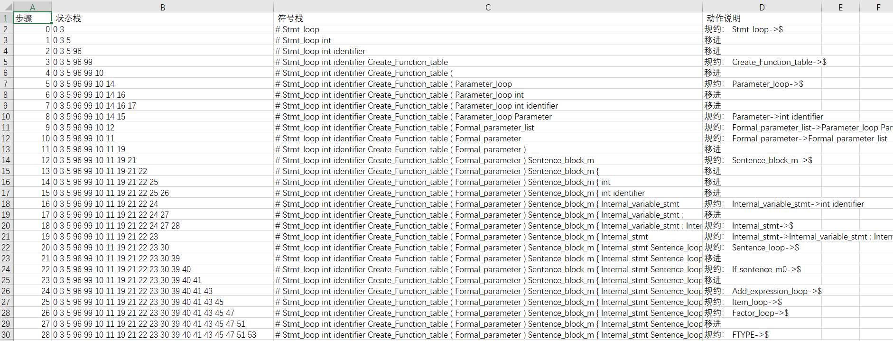 </td></tr>
    <tr>
		<td></td></tr>
</table>


## 7、语义分析错误提示

<table>
    <tr>
        <td>源码：未定义变量</td>
		<td>显示</td></tr>
    <tr>
		<td>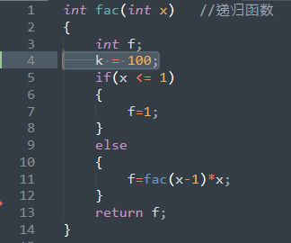</td>
		<td></td></tr>
</table>


<table>
    <tr>
        <td>源码：未定义函数</td>
		<td>显示</td></tr>
    <tr>
		<td>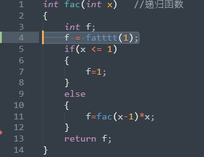</td>
		<td>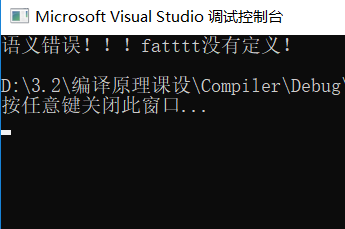</td></tr>
</table>


<table>
    <tr>
        <td>源码：数据类型不符</td>
		<td>显示</td></tr>
    <tr>
		<td>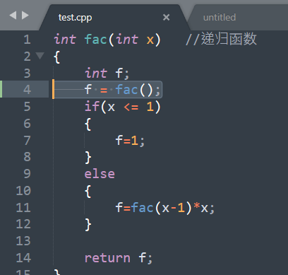</td>
		<td>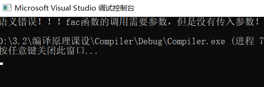</td></tr>
</table>


## 8、中间代码生成

**源码：**

```c++
int fac(int x)   //递归函数
{
	int f;
	if(x <= 1)
	{
		f=1;
	}
	else
	{
		f=fac(x-1)*x;
	}
 
	return f;
}

void main(void)
{
	int a;
	int b;
	int c;
	a=3;
	a=fac(fac(a));
	return;
}
```


**中间代码：**

```
0 (j, -, -, 25)
1 (fac, -, -, -)
2 (:=, x-facVar, -, T0)
3 (:=, 1, -, T1)
4 (j<=, T0, T1, 7)
5 (:=, 0, -, T0)
6 (j, -, -, 8)
7 (:=, 1, -, T0)
8 (j=, T0, 0, 13)
9 (j, -, -, 10)
10 (:=, 1, -, T2)
11 (:=, T2, -, f-facVar)
12 (j, -, -, 22)
13 (:=, x-facVar, -, T3)
14 (:=, 1, -, T4)
15 (-, T3, T4, T3)
16 (:=, T3, -, x-fac_paramerter 1)
17 (call, -, -, fac)
18 (:=, fac-return_value, -, T5)
19 (:=, x-facVar, -, T6)
20 (*, T5, T6, T5)
21 (:=, T5, -, f-facVar)
22 (:=, f-facVar, -, T7)
23 (:=, T7, -, fac-return_value)
24 (return, -, -, fac)
25 (main, -, -, -)
26 (:=, 3, -, T8)
27 (:=, T8, -, a-mainVar)
28 (:=, a-mainVar, -, T9)
29 (:=, T9, -, x-fac_paramerter 1)
30 (call, -, -, fac)
31 (:=, fac-return_value, -, T10)
32 (:=, T10, -, x-fac_paramerter 1)
33 (call, -, -, fac)
34 (:=, fac-return_value, -, T11)
35 (:=, T11, -, a-mainVar)
36 (return, -, -, main)
```


## 9、目标代码生成

**目标代码：**

```asm
lui $sp 0x1001 
lui $gp 0x1000 
j main  
fac :
#创建栈帧
sw $ra ($sp) 
sw $fp 4($sp) 
addi $fp $sp 4
addi $sp $sp 8
addi $sp $sp 4
#if判断
lw $t0 4096($gp) 
lw $t1 -8($fp) 
move $t0 $t1 
addi $t2 $zero 1
sle $t0 $t0 $t2
sw $t1 -8($fp) 
beq $t0 $zero Label_fac_if_end_0
addi $t3 $zero 1
lw $t4 4($fp) 
move $t4 $t3 
sw $t4 4($fp) 
j Label_fac_else_end_0  
Label_fac_if_end_0 :
lw $t5 4108($gp) 
lw $t6 -8($fp) 
move $t5 $t6 
addi $t7 $zero 1
sub $t5 $t5 $t7
sw $t5 ($sp) 
addi $sp $sp 4
sw $t6 -8($fp) 
jal fac
move $sp $fp 
lw $fp ($fp) 
addi $sp $sp -8
lw $t8 4116($gp) 
move $t8 $v0 
lw $t9 4120($gp) 
lw $t0 -8($fp) 
move $t9 $t0 
mult $t8 $t9 
mflo $t8  
lw $t1 4($fp) 
move $t1 $t8 
sw $t0 -8($fp) 
sw $t1 4($fp) 
Label_fac_else_end_0 :
lw $t2 4124($gp) 
lw $t3 4($fp) 
move $t2 $t3 
move $v0 $t2 
lw $ra -4($fp) 
sw $t3 4($fp) 
jr $ra  
main :
#创建栈帧
sw $ra ($sp) 
sw $fp 4($sp) 
addi $fp $sp 4
addi $sp $sp 8
addi $sp $sp 4
addi $sp $sp 4
addi $sp $sp 4
addi $t4 $zero 3
lw $t5 4($fp) 
move $t5 $t4 
lw $t6 4132($gp) 
move $t6 $t5 
sw $t6 ($sp) 
addi $sp $sp 4
sw $t5 4($fp) 
jal fac
move $sp $fp 
lw $fp ($fp) 
addi $sp $sp -8
lw $t7 4136($gp) 
move $t7 $v0 
sw $t7 ($sp) 
addi $sp $sp 4
jal fac
move $sp $fp 
lw $fp ($fp) 
addi $sp $sp -8
lw $t0 4140($gp) 
move $t0 $v0 
lw $t1 4($fp) 
move $t1 $t0 
sw $t1 4($fp) 
syscall
```


**MARS运行结果：**

&emsp;&emsp;使用VS2017运行上述代码后的结果是 $a = 720$。运行编译器生成的MIPS汇编指令后结果如下：

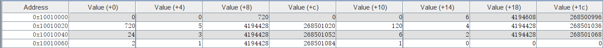

&emsp;&emsp;可以看见，在$Address = 0x10010008$ 即表示局部变量 $a$ 的内存地址上值为$720$。


# 七、遇到的问题
## 1、词法分析

&emsp;&emsp;在除法运算的情况下一直会报错，而与之类似的乘法运算没有发生过报错。进行断点调试后发现，“/”在判断“/*”与"//"代表注释的情况中被多读取一个符号并且没有回退，因此导致“/”作为运算符的判断一直出现错误。于是在判断为运算符"/"之后添加一个回退即解决问题。


## 2、语法分析

### 1)、右部为空的产生式的LR(0)项目

&emsp;&emsp;在构造SLR(1)文法的时候忽略掉右部为空的产生式所对应的项目，导致在构造项目集规范族的时候出现莫名其妙的移进冲突。在查看龙书相关方面的资料之后，对此做了统一处理。对于如下的产生式，
$$
GrammarSymbol \rightarrow \epsilon
$$
统一被处理为下面的项目。
$$
GrammarSymbol \rightarrow \cdot
$$


### 2)、移进-规约冲突

&emsp;&emsp;解决上述问题后，在构造SLR(1)文法的时候仍存在移进冲突。通过断点查询，是在构造$GO(X, I)$函数的时候存在问题。比如下例：

某项目集规范族：

> $E \rightarrow a \cdot A$
>
> $A \rightarrow \cdot c  A$
>
> $A\rightarrow  \cdot d$

在构造$GO(A, I)$的时候，只考虑到$A \rightarrow \cdot c  A$而忽略了$A\rightarrow  \cdot d$。因此，先在项目集规范族中循环寻找左部为$A$的产生式，再做这些产生式的$CLOSURE$闭包。


### 3)、Grammar文件存在问题

&emsp;&emsp;Grammar文件基本上按照课程设计提供的包含过程调用的文法来编写。但是，这样的文法在生成SLR(1)文法分析器的过程中持续出现移进-移进冲突与移进-规约冲突。仔细检查文法发现，文法中存在多处某些非终结符的候选式，其任何推导的头符号（终结符）集合存在相交。于是修改文法，使其两两不相交，但是出现了左递归的情况。后来通过查阅相关资料与亲自实验过后发现，左递归并不影响SLR(1)文法。


## 3、语义分析
### 1)、语义动作的定义

&emsp;&emsp;语义动作全部发生在语法规约的时候，且每一条产生式都需要一个语义动作。这里有将近50条产生式，给每条产生式一一编写对应的动作极其繁琐。于此同时，某些语义动作可能是需要在某条产生式的内部就要被执行，无法等到整条产生式被规约后才执行，因此引入了一些右部为空的产生式，这些产生式就是专门用来执行语义动作。

例如：

>While_sentence->while While_sentence_m1 ( Expression ) While_sentence_m2 Sentence_block
>
>While_sentence_m1->$
>
>While_sentence_m2->$

这里的While_sentence_m1与While_sentence_m2就是为了在中间代码生成和目标代码生成的时候产生回填与跳转以及Label的时候使用的。


### 2)、运算中间值的保存传递

&emsp;&emsp;对于赋值语句 $a = b + c;$，$b+c$产生的值如何传递给$a$是一个有点迷糊的问题。因为在编译的过程中，$b+c$是无法被计算出来，也就没有办法把计算出来的值直接传递给$a$。因此，这里采用的策略是申请一个临时变量$T_0$来表示b，一个临时变量$T_1$表示c，$T_0 = T_0 + T_1$，最后将$T_0$在符号表中的位置传递个$a$。


## 4、目标代码生成
### 1)、条件、循环语句执行错误

&emsp;&emsp;目标代码生成之后，只能执行简单的赋值语句，对于while、if语句无法正确执行。通过结合MARS断点调试与编译器断点调试，发现问题出现在寄存器的分配上。在条件分支与循环分支中，ASM代码中的寄存器分配与编译过程中的寄存器的分配的不一样的。对于循环分支，在ASM代码中由于循环与循环之间寄存器使用的情况各不相同，但是在编译的过程中却使用同一种分配方式。对于条件分支，编译的过程中相当于把每个分支都执行一次，但是在ASM代码中，每个分支执行与否是根据条件而定的。因此，解决方案就是在进入条件分支、循环分支之前，就需要将寄存器清空，保证临时寄存器没有被占用，这样ASM代码与编译过程的临时寄存器就够在条件选择、每次循环的过程中对应上。同理，在每次循环结束与条件分支结束的时候也需要进行寄存器的清空。


### 2)、条件、循环分支的Label重复问题

&emsp;&emsp;条件分支与循环分支都需要用到Label进行跳转，因此要保证各个Label不会重复是个很重要的问题。

这里需要定制一个规则从而避免重复。

>**Label_fac_if_end_0**

> **Label**表示这个是一个跳转使用的标签。
>
> **fac**表示当前的函数名。如果是在全局中，则用global。
>
> **if**表示这是一个条件分支。如果是循环分支，则用while表示。
>
> **end**表示if语句的结束。
>
> > if(else) 语句配套的有if_end, else_end
> >
> > while 语句有while_begin, while_end
>
> **0**表示这个在当前函数或者全局中的第0个if或者while分支。


### 3)、变量管理问题
&emsp;&emsp;临时变量、局部变量、全局变量、实参、返回值这5大类数据的管理至关重要。因为这5类变量的存储管理存在问题导致汇编代码无法正常运行。

> 全局变量：从0x10000000开始到0x10001000用来存储全局变量。
>
> 临时变量：从0x10001000开始到0x10010000用来存储临时变量。
>
> 局部变量：存储在栈帧中。从栈帧的老\$fp值开始，每次申明一个局部变量，\$sp就+4表示一个局部变量。
>
> 实参：在调用函数之前，一同存储到栈帧中。在返回地址的下面，一次存储每个需要传递的实参。
>
> 返回值：对于有返回值的函数，将返回值存储到\$v0寄存器中，调用返回后将\$v0中的值传递给某临时变量。


# 八、未来展望

## 1、GUI的设计

&emsp;&emsp;由于GUI不是本课程设计的重点，因此在完成课设的过程中并没有设计GUI。但是GUI能够更好的操作整个编译器，使用起来更加友好。因此，在课设完成之后会使用QT添加GUI操作与显示界面。


## 2、浮点数的运算

&emsp;&emsp;本编译器的运算只支持最简单的整数运算，同时也之只能识别整数常量。在未来中，会在词法分析器中识别浮点数，在目标代码中产生运算浮点数的汇编代码。


## 3、临时变量的释放

&emsp;&emsp;编译过程中，每个过程的临时变量全部存放在符号表中；汇编代码中，临时变量全部存放在从0x10001000开始到0x10010000的内存空间中。理想的情况下，每个过程块结束后都需要把临时变量清除掉，保证内存空间不会被这些仅仅使用过一次的临时变量耗尽。


# 九、心得体会

&emsp;&emsp;类C编译器是目前为止写过最复杂的C++项目。由于上学期做的语法分析器是LL(1)文法，而本次课设采用的是SLR(1)文法，因此整个项目差不多都是重新完成的。整个编译器的架构安排极其重要，参考课本、龙书等等资料后采用的是以语法分析器为中心，每次移进操作调用词法分析器，每次规约操作调用语义分析器。在语义分析的过中产生中间代码与目标代码。

&emsp;&emsp;大部分的时间花在SLR(1)文法的构造与语义分析上。给每条产生式配上相应的语义动作，进行语义检查、中间代码、目标代码的生成，整个过程极其庞大复杂。在语义分析的过程中还需要维护符号表，给不同类型的变量、作用于分配不同的符号表。

&emsp;&emsp;最后是把中间代码与目标代码和语义分析过程中的语义动作与符号表结合起来。由于课本上关于符号表的资料比较少，所以在刚刚开始做代码生成的时候有点迷糊，不知道变量该怎么安排，尤其是临时变量。后来通过大量查阅资料，才有了在编译过程中的全局符号表、临时变量符号表、函数作用域符号表的结构以及汇编过程中\$gp中的临时变量、全局变量；\$fp+\$sp中的局部变量与参数。

&emsp;&emsp;由于编译器的工程量比较大，时间跨度也比较长，经常出现前几天做的东西过几天就忘了，做的东西很容易和之前的想法发生冲突；以及经常在修改的过程中发生错误，因此每天完成指定的任务后就使用git将当前版本与对应的注释一同添加到本地仓库做好备份和版本管理。

&emsp;&emsp;一言以蔽之，通过编写类C编译器的这个课程设计，使我更加了解编译背后的原理，同时也提高了对于复杂项目的组织管理能力。


